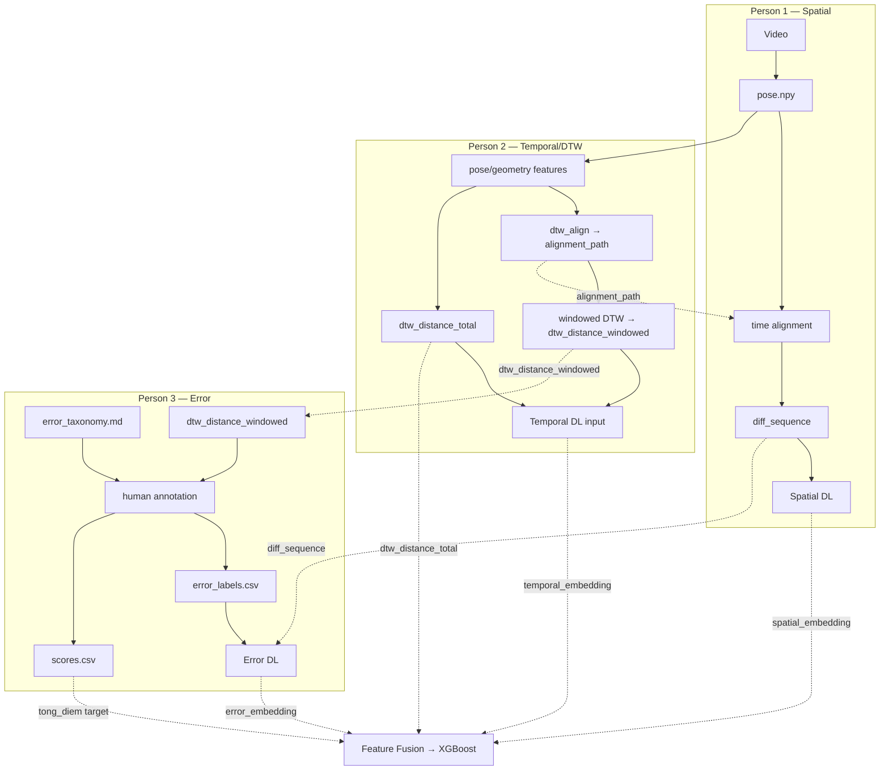

# docs/data_format.md — DRAFT v0.1 (for team review)

**Status:** DRAFT — for team review, not final specification.
**Purpose:** Data contract giữa Person 1 (Spatial), Person 2 (Temporal/DTW), Person 3 (Error) để mỗi người code độc lập nhưng output tương thích với nhau.
**Architecture (giữ nguyên, không đổi):**

```text
Video + dance_id
        ↓
Reference pose
        ↓
MediaPipe / preprocessing
        ↓
time alignment
        ↓
diff_sequence
        ↓
┌──────────────┬───────────────┬──────────────┐
│ Spatial DL   │ Temporal DL   │ Error DL     │
│ Person 1     │ Person 2      │ Person 3     │
└──────────────┴───────────────┴──────────────┘
        ↓
Feature Fusion → XGBoost
```

---

## B1. `pose.npy`

**Schema bắt buộc (không được tự ý đổi):**
```text
T × 33 × 4
```

| Chiều | Ý nghĩa |
|---|---|
| `T` | Số frame của video (phụ thuộc độ dài video và FPS trích xuất) |
| `33` | Số landmark theo chuẩn MediaPipe Pose (landmark index 0–32) |
| `4` | `[x, y, z, visibility]` cho mỗi landmark |

- **Landmark ordering:** theo đúng thứ tự enum chuẩn của MediaPipe Pose (0 = nose, ... 32 = right_foot_index). Team cần xác nhận đang dùng **MediaPipe Pose** (không phải Holistic hay BlazePose variant khác), và không tự reorder landmark theo thứ tự khác.
- **dtype đề xuất:** `float32` — `[PROPOSED]`, cần xác nhận chính thức.
- **Coordinate system:** `[NEEDS REVIEW]` — MediaPipe mặc định trả về x,y normalized theo kích thước khung hình (0.0–1.0), z là độ sâu tương đối. Chưa chốt có giữ nguyên hay chuẩn hoá thêm trước khi lưu `pose.npy`.
  - *Phương án A (đề xuất):* giữ `pose.npy` là raw coordinate thô, center/scale làm ở bước preprocessing riêng — tách biệt rõ 2 bước, đúng với kiến trúc đã thiết kế, dễ debug.
  - *Phương án B:* center/scale ngay lúc extract, lưu luôn vào `pose.npy` — nhanh hơn nhưng khó debug riêng từng bước, khó đổi cách normalize sau này.
- **FPS / time mapping:** `[NEEDS REVIEW]` — chưa chốt dùng FPS gốc của từng video hay resample về 1 chuẩn.
  - *Phương án A (đề xuất):* resample mọi video về FPS cố định (vd. 30fps) ngay khi extract — đơn giản hóa mọi tính toán DTW/window/alignment sau này vì mọi video đồng nhất.
  - *Phương án B:* giữ nguyên FPS gốc, lưu kèm FPS riêng cho mỗi file — không mất dữ liệu gốc nhưng mọi nơi dùng `pose.npy` phải tra FPS, dễ gây lỗi nếu quên.
- **Visibility:** giá trị do MediaPipe trả về (0.0–1.0), thể hiện độ tin cậy của landmark đó tại frame đó.
- **Missing / low-confidence landmark:** `[NEEDS REVIEW]` — chưa chốt ngưỡng visibility coi là "missing" và cách xử lý.
  - *Phương án A (đề xuất):* ngưỡng visibility < 0.5 → interpolate tuyến tính từ frame trước/sau; nếu 1 landmark mất liên tục >1 giây (quá dài để interpolate đáng tin) → flag cả đoạn video đó cần xem lại chất lượng quay.
  - *Phương án B:* ngưỡng tùy theo từng landmark (một số điểm quan trọng hơn, ngưỡng chặt hơn) — chính xác hơn nhưng phức tạp hóa không cần thiết ở giai đoạn đầu.

**Producer:** Person 1.
**Interface:**
```python
extract_pose(video_path: str) -> np.ndarray  # shape (T, 33, 4), dtype float32
```

---

## B2. `diff_sequence`

**Schema bắt buộc (không được tự ý đổi):**
```text
T × 33 × 3
```

```text
diff_sequence[t, joint, :] = [dx, dy, dz]
```

**Định nghĩa quan trọng:** `diff_sequence` là hiệu số giữa pose của performer và pose của reference **SAU KHI đã time-align** — KHÔNG phải hiệu số thô giữa 2 video chưa được khớp thời gian với nhau.

```text
performer_pose  (T_p × 33 × 4)
reference_pose  (T_r × 33 × 4)
        ↓  [time alignment — dùng alignment_path từ Person 2]
performer_aligned, reference_aligned  (cùng độ dài T sau align)
        ↓  compute_diff()
diff_sequence  (T × 33 × 3)
```

- **Input:** `performer_pose`, `reference_pose` (cả hai đã qua preprocessing — center/scale), và `alignment_path` do Person 2 cung cấp (từ `dtw_align`).
- **Output shape:** `T × 33 × 3` — lưu ý: chỉ có 3 giá trị cuối (dx, dy, dz), **không mang theo visibility** vì đây là hiệu số giữa 2 tọa độ, không phải pose gốc.
- **Mapping frame/keypoint:** `diff_sequence[t, j]` tương ứng với độ lệch của landmark `j` tại thời điểm đã align `t` — `t` ở đây là trục thời gian **sau** alignment, không nhất thiết trùng với frame index gốc của performer.
- **Ý nghĩa dx/dy/dz:** `dx = performer_x - reference_x` (tương tự cho dy, dz) tại cùng joint, cùng thời điểm đã align. `[NEEDS REVIEW]` — phụ thuộc vào quyết định ở B1 (nếu chọn Phương án A — `pose.npy` raw — thì `compute_diff()` phải nhận input là pose đã qua preprocessing, không nhận raw trực tiếp).
- **Cách lưu:** `[PROPOSED]` — đề xuất `.npy` theo quy ước tên file `{dance_id}_{video_id}_diff.npy`, cần nhóm xác nhận.
- **Dependency với Person 2:** `compute_diff()` do Person 1 viết, nhưng **bắt buộc nhận `alignment_path`** từ `dtw_align()` của Person 2 làm input — đây là 1 trong các điểm phối hợp bắt buộc giữa 2 người (xem Phần C).

**Producer:** Person 1 (dùng input từ Person 2).
**Interface:**
```python
compute_diff(performer_pose, reference_pose, alignment_path) -> np.ndarray  # (T, 33, 3)
```

---

## B3. DTW — 3 output riêng biệt, KHÔNG được gộp thành 1 biến chung

### 1. `alignment_path`
```python
dtw_align(performer_features, reference_features) -> alignment_path
```
Dùng để hỗ trợ Person 1 time-align performer và reference trước khi tính `diff_sequence`. `[NEEDS REVIEW]` — chưa quy định cấu trúc dữ liệu cụ thể.
- *Phương án A (đề xuất):* list các cặp index `[(performer_idx, reference_idx), ...]` — dùng trực tiếp output mặc định của thư viện DTW (vd. `fastdtw`/`dtaidistance` trả về sẵn dạng này), không cần code thêm.
- *Phương án B:* warping function (hàm nội suy liên tục) — mượt hơn nhưng phức tạp hơn, không cần thiết cho scope hiện tại.

### 2. `dtw_distance_windowed`
```python
dtw_distance_windowed(performer, reference, window) -> distance_per_segment
```
Mỗi đoạn ~2–3 giây có 1 giá trị float. Dùng bởi Person 3 để tìm đoạn "nghi ngờ lệch" — **chỉ là gợi ý**, không phải nhãn lỗi.

### 3. `dtw_distance_total`
```python
dtw_distance_total(performer, reference) -> float
```
1 giá trị duy nhất cho cả video, dùng làm feature đưa vào Feature Fusion.

**Lưu ý bắt buộc:** 3 output trên phục vụ 3 mục đích khác nhau (alignment / gợi ý gán nhãn / feature fusion) và phải được code, đặt tên, lưu trữ **riêng biệt** — không dùng chung 1 biến/1 tên file `dtw_distance` cho cả 3.

**Producer:** Person 2.

---

## B4. Window 2–3 giây cho `dtw_distance_windowed` — `[PROPOSED]`

Metadata tối thiểu đề xuất để mapping được với `error_labels.csv`:

```text
dance_id, video_id, window_id, start_time, end_time, dtw_distance
```

`[PROPOSED]` — đây là đề xuất của tài liệu này, **chưa phải schema chính thức**:

| Vấn đề | Phương án A (đề xuất) | Phương án B |
|---|---|---|
| Window size / Stride | 3 giây, stride 3s (không overlap) — đơn giản nhất, ít đoạn nhất cho annotator | Window 3s, stride 1.5s (overlap 50%) — bắt lỗi chính xác hơn ở ranh giới nhưng tăng gấp đôi số đoạn cần gán nhãn |
| Timestamp | Giây, dạng float, tính từ đầu video | Frame index — khớp trực tiếp với mảng pose nhưng khó đọc bằng mắt khi annotator xem video |
| Đoạn cuối video ngắn hơn 1 window | Giữ nguyên, không pad/bỏ — vẫn tính `dtw_distance` trên đoạn ngắn hơn đó | Bỏ qua đoạn cuối nếu ngắn hơn window — đơn giản hơn nhưng mất dữ liệu |
| Mapping `window_id` ↔ `error_labels.csv` | Dùng chung `start_time`/`end_time` làm khóa (không cần `window_id` riêng) | Thêm `window_id` tường minh — rõ ràng hơn nếu sau này đổi sang overlap |

**`[NEEDS REVIEW]`** — cả 4 dòng trên đều cần nhóm họp xác nhận. Ngoài ra còn các vấn đề liên quan: FPS ảnh hưởng thế nào đến việc chia window (phụ thuộc quyết định FPS ở B1).

---

## B5. `annotations/scores.csv`

**Schema bắt buộc (không đổi tên field):**
```text
dance_id, video_id, khop_dong_tac, khop_nhip, nang_luong, tong_diem
```

| Field | Ý nghĩa |
|---|---|
| `dance_id` | Định danh bài nhảy |
| `video_id` | Định danh video performer |
| `khop_dong_tac` | Điểm khớp động tác (thang 0–100, theo tài liệu triển khai) |
| `khop_nhip` | Điểm khớp nhịp (thang 0–100) |
| `nang_luong` | Điểm năng lượng/biên độ (thang 0–100) |
| `tong_diem` | Tổng điểm (0–300, theo tài liệu triển khai) |

`[NEEDS REVIEW]` — tài liệu triển khai xác nhận 3 tiêu chí con thang 0–100 và tổng 0–300, nhưng chưa quy định công thức. Không tự bịa công thức — đề xuất 2 phương án để nhóm/người chấm xác nhận:
- *Phương án A (đề xuất):* `tong_diem = khop_dong_tac + khop_nhip + nang_luong` (tổng đơn giản, không trọng số) — dễ hiểu, dễ giải thích, đúng nguyên tắc "đơn giản trước".
- *Phương án B:* có trọng số khác nhau giữa 3 tiêu chí (vd. khớp nhịp quan trọng hơn trong dance) — phản ánh đúng thực tế hơn nhưng cần nhóm/người chấm thảo luận thống nhất trọng số trước, tốn thêm thời gian.

**Ví dụ minh họa (Example only — not real annotation data):**
```csv
dance_id,video_id,khop_dong_tac,khop_nhip,nang_luong,tong_diem
dance_001,dance001_person001_take1,78,70,82,230
dance_001,dance001_person002_take1,55,60,58,173
```

**Producer:** Person 3 (tổng hợp từ người chấm điểm).

---

## B6. `annotations/error_labels.csv`

**Schema bắt buộc (không đổi tên field):**
```text
dance_id, video_id, start_time, end_time, error_type, severity
```

| Field | Ý nghĩa |
|---|---|
| `dance_id` | Định danh bài nhảy |
| `video_id` | Định danh video performer |
| `start_time` | Thời điểm bắt đầu đoạn lỗi |
| `end_time` | Thời điểm kết thúc đoạn lỗi |
| `error_type` | Một trong: `off_beat`, `wrong_move`, `low_amplitude`, `wrong_direction`, `missed_move` |
| `severity` | Mức độ nghiêm trọng (xem `error_taxonomy.md` mục A5 — draft, `[NEEDS REVIEW]`) |
| `note` *(đề xuất, chưa chốt)* | `[PROPOSED]` — cột ghi chú tự do khi annotator không chắc chắn, xem `error_taxonomy.md` mục A4. |

**Timestamp format:** `[NEEDS REVIEW]` — tài liệu chưa quyết định chính thức. **Không được tự ý đổi thành frame index** cho đến khi nhóm xác nhận.
- *Phương án A (đề xuất):* giây, dạng float, tính từ đầu video (vd. `12.5`) — dễ dùng khi annotator xem video bằng mắt/tai.
- *Phương án B:* frame index — khớp trực tiếp với mảng pose nhưng khó đọc khi gán nhãn tay.

**Các tình huống cần hỗ trợ (đã thiết kế theo multi-label):**
- Một video có nhiều dòng lỗi (nhiều đoạn, nhiều loại) — bình thường.
- Một lỗi kéo dài nhiều window DTW — `start_time`/`end_time` của 1 dòng lỗi có thể dài hơn 1 window 2-3s nếu annotator xác định lỗi đó thực tế kéo dài qua nhiều window liên tiếp.
- Nhiều lỗi xảy ra trong cùng khoảng thời gian (overlapping interval) — được phép, thể hiện bằng nhiều dòng có cùng hoặc chồng lấn `start_time`/`end_time` nhưng khác `error_type` (xem `error_taxonomy.md` mục A4).
- Multi-label: xem đầy đủ nguyên tắc tại `error_taxonomy.md` mục A4.

**Ví dụ minh họa (Example only — not real annotation data):**
```csv
dance_id,video_id,start_time,end_time,error_type,severity
dance_001,dance001_person001_take1,3.0,6.0,off_beat,0.6
dance_001,dance001_person001_take1,24.0,27.0,low_amplitude,0.4
dance_001,dance001_person002_take1,9.0,12.0,wrong_move,0.8
```

**Producer:** Person 3 (từ quy trình: DTW gợi ý → annotator xác nhận/phân loại).

---

## B7. Data flow giữa 3 Person



**Interface bắt buộc phải thống nhất:**

- **Person 1 ↔ Person 2:** `alignment_path` (Person 2 → Person 1, dùng để tính `diff_sequence`); `pose.npy` (Person 1 → Person 2, dùng để tính geometry/DTW).
- **Person 1 ↔ Person 3:** `diff_sequence` (Person 1 → Person 3, dùng làm input cho Error DL model).
- **Person 2 ↔ Person 3:** `dtw_distance_windowed` (Person 2 → Person 3, dùng làm gợi ý gán nhãn).

---

## PHẦN C — Interface Contract

| Producer | Output | Consumer | Required format | Status |
|---|---|---|---|---|
| Person 1 | `pose.npy` | Person 2, Person 1 (chính mình, bước sau) | `T × 33 × 4`, float32 | `[NEEDS REVIEW]` — FPS, coordinate normalization chưa chốt, xem phương án đề xuất ở B1 |
| Person 2 | `alignment_path` | Person 1 | Cấu trúc dữ liệu cụ thể | `[NEEDS REVIEW]` — xem phương án đề xuất ở B3 |
| Person 1 | `diff_sequence` | Person 3, Spatial DL | `T × 33 × 3` | `[NEEDS REVIEW]` — cách lưu file, quy ước tên chưa chốt |
| Person 2 | `dtw_distance_windowed` | Person 3 | scalar float / đoạn 2-3s | `[NEEDS REVIEW]` — window/stride/overlap chưa chốt, xem phương án đề xuất ở B4 |
| Person 2 | `dtw_distance_total` | Fusion | scalar float / video | Tương đối rõ, không có tham số cần thống nhất thêm |
| Person 3 | `error_labels.csv` | Error DL, Fusion | `dance_id, video_id, start_time, end_time, error_type, severity` | `[NEEDS REVIEW]` — timestamp format, severity scale chưa chốt, xem phương án đề xuất ở B6 và error_taxonomy.md A5 |
| Person 3 | `scores.csv` | Scoring (XGBoost), Fusion | `dance_id, video_id, khop_dong_tac, khop_nhip, nang_luong, tong_diem` | `[NEEDS REVIEW]` — công thức `tong_diem` chưa chốt, xem phương án đề xuất ở B5 |

---

## PHẦN E — Open Questions

| # | Question | Người liên quan | Tại sao cần quyết định | Status | Phương án đề xuất |
|---|---|---|---|---|---|
| 1 | Thứ tự chính xác của 33 MediaPipe landmarks | Cả 3 | Mapping sai thứ tự sẽ làm mọi tính toán geometry/diff sai hoàn toàn | Theo chuẩn MediaPipe Pose — cần xác nhận dùng đúng thư viện/phiên bản | Dùng enum chuẩn của MediaPipe Pose, không tự reorder |
| 2 | Coordinate system của x/y/z | Person 1 | Ảnh hưởng đến mọi phép tính diff/geometry sau này | `[NEEDS REVIEW]` | Xem B1 Phương án A/B |
| 3 | Có normalize coordinate không (center/scale) | Person 1 | Ảnh hưởng đến khả năng so sánh giữa người cao/thấp khác nhau | `[NEEDS REVIEW]` | Xem B1 Phương án A/B |
| 4 | FPS có cố định không | Person 1, Person 2 | Ảnh hưởng đến `T`, đến window DTW, đến mapping timestamp | `[NEEDS REVIEW]` | Xem B1 Phương án A/B |
| 5 | Cách xử lý missing/low-visibility landmarks | Person 1 | Ảnh hưởng chất lượng pose đầu vào cho mọi nhánh | `[NEEDS REVIEW]` | Xem B1 Phương án A/B |
| 6 | DTW window chính xác bao nhiêu giây | Person 2, Person 3 | Ảnh hưởng độ chi tiết của gán nhãn lỗi | `[NEEDS REVIEW]` | Xem B4 Phương án A/B |
| 7 | DTW stride bao nhiêu | Person 2 | Ảnh hưởng số lượng đoạn cần annotator xem | `[NEEDS REVIEW]` | Xem B4 Phương án A/B |
| 8 | Các window có overlap không | Person 2, Person 3 | Ảnh hưởng cách mapping với error_labels.csv | `[NEEDS REVIEW]` | Xem B4 Phương án A/B |
| 9 | Xử lý window cuối video (ngắn hơn window chuẩn) | Person 2 | Tránh lỗi index/thiếu dữ liệu ở cuối video | `[NEEDS REVIEW]` | Xem B4 Phương án A/B |
| 10 | Timestamp format (giây float hay khác) | Person 2, Person 3 | Ảnh hưởng mapping DTW ↔ error_labels.csv | `[NEEDS REVIEW]` | Xem B6 Phương án A/B |
| 11 | Severity có bao nhiêu mức | Person 3 | Ảnh hưởng cách train Error DL | `[NEEDS REVIEW]` | Xem error_taxonomy.md A5 Phương án A/B |
| 12 | Cách xác định severity | Person 3 | Ảnh hưởng tính nhất quán giữa các annotator | `[NEEDS REVIEW]` | Xem error_taxonomy.md A5 |
| 13 | Multi-label có cho phép nhiều error cùng timestamp không | Person 3 | Ảnh hưởng thiết kế loss function của Error DL | Đã xác nhận CÓ cho phép | — (xem error_taxonomy.md A4) |
| 14 | Có cho phép overlapping intervals không | Person 3 | Ảnh hưởng cách xử lý dữ liệu khi windowing cho model | Đã xác nhận CÓ cho phép | — (xem error_taxonomy.md A4) |
| 15 | Công thức `tong_diem` | Person 3 | Ảnh hưởng target training của XGBoost | `[NEEDS REVIEW]` | Xem B5 Phương án A/B |
| 16 | Mapping giữa DTW window và error annotation | Person 2, Person 3 | Cần để tự động gợi ý đoạn nghi ngờ | `[PROPOSED]` | Dùng chung `start_time`/`end_time`, cần xác nhận |
| 17 | Quy ước `dance_id` | Cả 3 | Tránh nhầm lẫn khi có nhiều bài | `[NEEDS REVIEW]` | Đề xuất `dance_001`, `dance_002`... |
| 18 | Quy ước `video_id` | Cả 3 | Tránh nhầm lẫn khi có nhiều performer/take | `[NEEDS REVIEW]` | Đề xuất `{dance_id}_person{N}_take{M}` |
| 19 | Xử lý "uncertain case" khi annotator không chắc | Person 3 | Ảnh hưởng độ sạch của dữ liệu training | `[NEEDS REVIEW]` | Xem error_taxonomy.md A4 Phương án A/B |
| 20 | Priority/hierarchy giữa 5 lỗi khi khó phân biệt | Person 3 | Ảnh hưởng cách annotator xử lý case mơ hồ | `[NEEDS REVIEW]` | Mặc định đề xuất: KHÔNG tạo hierarchy, dựa vào Boundary/distinction |

---

## PHẦN F — Final Review Checklist

### Taxonomy
- [ ] 5 error_type đã thống nhất
- [ ] Definition không overlap quá mức
- [ ] Có positive example
- [ ] Có negative example
- [ ] Có rule phân biệt lỗi gần nhau
- [ ] Đã thống nhất multi-label
- [ ] Đã thống nhất severity

### Data
- [ ] `pose.npy = T × 33 × 4`
- [ ] 33 landmarks thống nhất
- [ ] Coordinate system thống nhất
- [ ] FPS thống nhất
- [ ] `diff_sequence = T × 33 × 3`
- [ ] Đã thống nhất ý nghĩa dx/dy/dz
- [ ] DTW alignment path thống nhất
- [ ] Windowed DTW thống nhất
- [ ] Total DTW thống nhất
- [ ] Timestamp thống nhất
- [ ] `scores.csv` thống nhất
- [ ] `error_labels.csv` thống nhất
- [ ] Multi-label/overlap thống nhất

### Interface
- [ ] Person 1 biết chính xác input/output
- [ ] Person 2 biết chính xác input/output
- [ ] Person 3 biết chính xác input/output
- [ ] Có sample data để test (xem `docs/data_format_examples.md`)
- [ ] Có ít nhất một video chạy thử end-to-end

---

## Tổng kết các điểm chưa thể chốt (self-review)

Tài liệu này **vẫn là DRAFT, chưa phải specification cuối cùng**. Các điểm sau còn `[NEEDS REVIEW]`, mỗi điểm đã có **phương án đề xuất** (xem các mục B1–B6 tương ứng) để nhóm họp chọn (A, B, hoặc phương án khác), **chưa phải quyết định chính thức**:

1. Coordinate normalization cho `pose.npy` (B1) — có đề xuất 2 phương án.
2. FPS trích xuất cố định hay giữ nguyên theo từng video (B1) — có đề xuất 2 phương án.
3. Ngưỡng/cách xử lý missing landmark (B1) — có đề xuất 2 phương án.
4. Cấu trúc dữ liệu cụ thể của `alignment_path` (B3) — có đề xuất 2 phương án.
5. Window size, stride, overlap cho DTW windowed (B4) — có đề xuất 2 phương án.
6. Timestamp format chính thức cho `error_labels.csv` (B6) — có đề xuất 2 phương án.
7. Công thức tính `tong_diem` từ 3 tiêu chí con (B5) — có đề xuất 2 phương án.
8. Thang đo severity chính thức (xem error_taxonomy.md A5) — có đề xuất 2 phương án.
9. Quy trình xử lý "uncertain case" khi annotator không chắc chắn (xem error_taxonomy.md A4) — có đề xuất 2 phương án.
10. Quy ước đặt tên file cho `diff_sequence`, `dtw_distance_windowed` khi lưu ra đĩa — `[PROPOSED]`, cần xác nhận.

**Việc cần làm:** họp nhóm, đi qua từng mục, chọn phương án (hoặc đề xuất phương án khác), rồi mới cập nhật tài liệu thành bản chính thức trước khi bắt đầu code Tuần 2.
