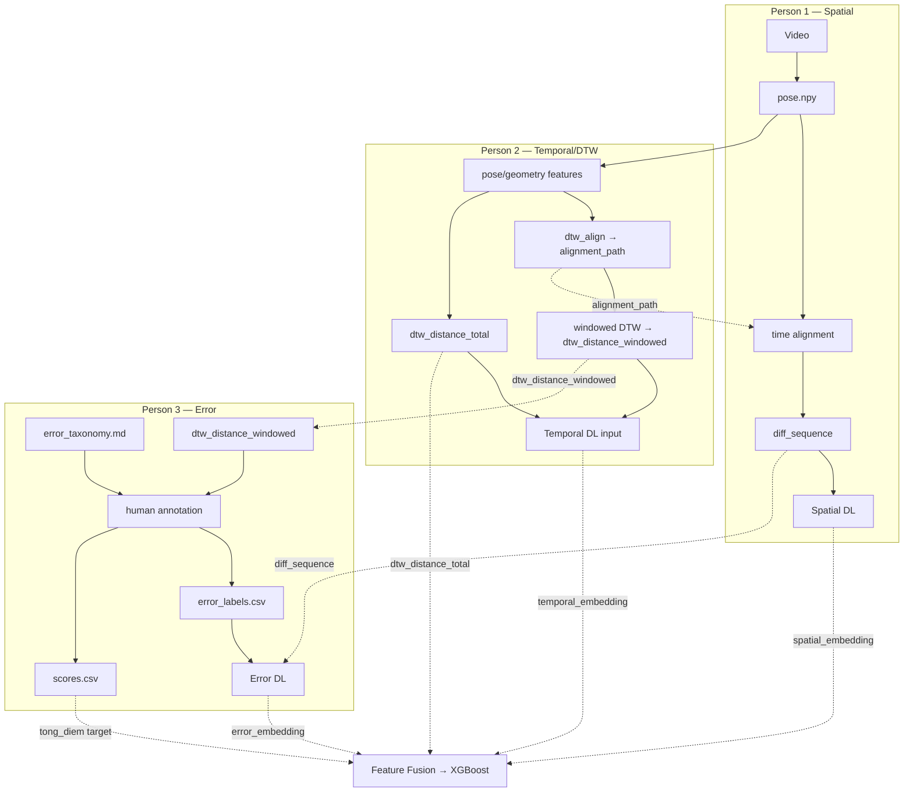

# docs/data_format.md — DRAFT v0.1 (for team review)

**Status:** DRAFT — for team review, not final specification.
**Purpose:** Data contract giữa Person 1 (Spatial), Person 2 (Temporal/DTW), Person 3 (Error) để mỗi người code độc lập nhưng output tương thích với nhau.
**Architecture (giữ nguyên, không đổi):**

```text
Video + dance_id
        ↓
Reference pose
        ↓
MediaPipe / preprocessing
        ↓
time alignment
        ↓
diff_sequence
        ↓
┌──────────────┬───────────────┬──────────────┐
│ Spatial DL   │ Temporal DL   │ Error DL     │
│ Person 1     │ Person 2      │ Person 3     │
└──────────────┴───────────────┴──────────────┘
        ↓
Feature Fusion → XGBoost
```

---

## B1. `pose.npy`

**Schema bắt buộc (không được tự ý đổi):**
```text
T × 33 × 4
```

| Chiều | Ý nghĩa |
|---|---|
| `T` | Số frame của video (phụ thuộc độ dài video và FPS trích xuất) |
| `33` | Số landmark theo chuẩn MediaPipe Pose (landmark index 0–32) |
| `4` | `[x, y, z, visibility]` cho mỗi landmark |

- **Landmark ordering:** theo đúng thứ tự enum chuẩn của MediaPipe Pose (0 = nose, ... 32 = right_foot_index). Team cần xác nhận đang dùng **MediaPipe Pose** (không phải Holistic hay BlazePose variant khác), và không tự reorder landmark theo thứ tự khác.
- **dtype đề xuất:** `float32` — `[PROPOSED]`, cần xác nhận chính thức.
- **Coordinate system:** ✅ **ĐÃ CHỐT:** `pose.npy` giữ **raw coordinate thô** do MediaPipe trả về (x,y normalized 0.0–1.0, z độ sâu tương đối). Center theo hip và scale theo chiều cao thực hiện ở bước **preprocessing riêng**, không gộp vào bước extract.
- **FPS / time mapping:** ✅ **ĐÃ CHỐT:** Resample mọi video về **FPS cố định = 30fps** ngay tại bước extract.
- **Visibility:** giá trị do MediaPipe trả về (0.0–1.0), thể hiện độ tin cậy của landmark đó tại frame đó.
- **Missing / low-confidence landmark:** ✅ **ĐÃ CHỐT:** Ngưỡng **visibility < 0.5** coi là missing. Xử lý bằng **interpolate tuyến tính** từ frame trước/sau. Nếu 1 landmark mất liên tục **>1 giây** → **flag cả đoạn video đó** cần xem lại chất lượng quay, không cố interpolate liều.

**Producer:** Person 1.
**Interface:**
```python
extract_pose(video_path: str) -> np.ndarray  # shape (T, 33, 4), dtype float32
```

---

## B2. `diff_sequence`

**Schema bắt buộc (không được tự ý đổi):**
```text
T × 33 × 3
```

```text
diff_sequence[t, joint, :] = [dx, dy, dz]
```

**Định nghĩa quan trọng:** `diff_sequence` là hiệu số giữa pose của performer và pose của reference **SAU KHI đã time-align** — KHÔNG phải hiệu số thô giữa 2 video chưa được khớp thời gian với nhau.

```text
performer_pose  (T_p × 33 × 4)
reference_pose  (T_r × 33 × 4)
        ↓  [time alignment — dùng alignment_path từ Person 2]
performer_aligned, reference_aligned  (cùng độ dài T sau align)
        ↓  compute_diff()
diff_sequence  (T × 33 × 3)
```

- **Input:** `performer_pose`, `reference_pose` (cả hai đã qua preprocessing — center/scale), và `alignment_path` do Person 2 cung cấp (từ `dtw_align`).
- **Output shape:** `T × 33 × 3` — lưu ý: chỉ có 3 giá trị cuối (dx, dy, dz), **không mang theo visibility** vì đây là hiệu số giữa 2 tọa độ, không phải pose gốc.
- **Mapping frame/keypoint:** `diff_sequence[t, j]` tương ứng với độ lệch của landmark `j` tại thời điểm đã align `t` — `t` ở đây là trục thời gian **sau** alignment, không nhất thiết trùng với frame index gốc của performer.
- **Ý nghĩa dx/dy/dz:** `dx = performer_x - reference_x` (tương tự cho dy, dz) tại cùng joint, cùng thời điểm đã align. Vì `pose.npy` là raw (đã chốt ở B1), `compute_diff()` nhận input là pose **đã qua preprocessing**, không nhận raw `pose.npy` trực tiếp.
- **Cách lưu:** ✅ **ĐÃ CHỐT:** `.npy` theo quy ước tên file `{dance_id}_{video_id}_diff.npy`.
- **Dependency với Person 2:** `compute_diff()` do Person 1 viết, nhưng **bắt buộc nhận `alignment_path`** từ `dtw_align()` của Person 2 làm input — đây là 1 trong các điểm phối hợp bắt buộc giữa 2 người (xem Phần C).

**Producer:** Person 1 (dùng input từ Person 2).
**Interface:**
```python
compute_diff(performer_pose, reference_pose, alignment_path) -> np.ndarray  # (T, 33, 3)
```

---

## B3. DTW — 3 output riêng biệt, KHÔNG được gộp thành 1 biến chung

### 1. `alignment_path`
```python
dtw_align(performer_features, reference_features) -> alignment_path
```
Dùng để hỗ trợ Person 1 time-align performer và reference trước khi tính `diff_sequence`. ✅ **ĐÃ CHỐT:** `alignment_path` là **list các cặp index** `[(performer_idx, reference_idx), ...]` — dùng trực tiếp output mặc định của thư viện DTW (`fastdtw`/`dtaidistance`), không cần tự code thêm cấu trúc riêng.

### 2. `dtw_distance_windowed`
```python
dtw_distance_windowed(performer, reference, window) -> distance_per_segment
```
Mỗi đoạn ~2–3 giây có 1 giá trị float. Dùng bởi Person 3 để tìm đoạn "nghi ngờ lệch" — **chỉ là gợi ý**, không phải nhãn lỗi.

### 3. `dtw_distance_total`
```python
dtw_distance_total(performer, reference) -> float
```
1 giá trị duy nhất cho cả video, dùng làm feature đưa vào Feature Fusion.

**Lưu ý bắt buộc:** 3 output trên phục vụ 3 mục đích khác nhau (alignment / gợi ý gán nhãn / feature fusion) và phải được code, đặt tên, lưu trữ **riêng biệt** — không dùng chung 1 biến/1 tên file `dtw_distance` cho cả 3.

**Producer:** Person 2.

---

## B4. Window 2–3 giây cho `dtw_distance_windowed` — `[PROPOSED]`

Metadata tối thiểu đề xuất để mapping được với `error_labels.csv`:

```text
dance_id, video_id, window_id, start_time, end_time, dtw_distance
```

✅ **ĐÃ CHỐT (schema chính thức):**

| Vấn đề | Quyết định |
|---|---|
| Window size | 3 giây |
| Stride | 3 giây (không overlap) |
| Timestamp | Giây, dạng float, tính từ đầu video |
| Đoạn cuối video ngắn hơn 1 window | Giữ nguyên, không pad, không bỏ — vẫn tính `dtw_distance` trên đoạn ngắn hơn đó |
| Mapping `window_id` ↔ `error_labels.csv` | Dùng chung `start_time`/`end_time` làm khóa, không cần `window_id` riêng |

**Ghi chú:** nếu sau khi pilot-test (Tuần 3) phát hiện nhiều lỗi "lọt" ở ranh giới window, cân nhắc nâng cấp sang overlap 50% (stride 1.5s) ở bản sau — không ảnh hưởng các quyết định khác.

---

## B5. `annotations/scores.csv`

**Schema bắt buộc (không đổi tên field):**
```text
dance_id, video_id, khop_dong_tac, khop_nhip, nang_luong, tong_diem
```

| Field | Ý nghĩa |
|---|---|
| `dance_id` | Định danh bài nhảy |
| `video_id` | Định danh video performer |
| `khop_dong_tac` | Điểm khớp động tác (thang 0–100, theo tài liệu triển khai) |
| `khop_nhip` | Điểm khớp nhịp (thang 0–100) |
| `nang_luong` | Điểm năng lượng/biên độ (thang 0–100) |
| `tong_diem` | Tổng điểm (0–300, theo tài liệu triển khai) |

✅ **ĐÃ CHỐT:** `tong_diem = khop_dong_tac + khop_nhip + nang_luong` (tổng đơn giản, không trọng số). Ghi chú cho báo cáo: đây là giả định đơn giản hoá (coi 3 tiêu chí quan trọng ngang nhau), có thể là hướng cải tiến (thêm trọng số) ở bản sau nếu dữ liệu thực tế cho thấy cần thiết.

**Ví dụ minh họa (Example only — not real annotation data):**
```csv
dance_id,video_id,khop_dong_tac,khop_nhip,nang_luong,tong_diem
dance_001,dance001_person001_take1,78,70,82,230
dance_001,dance001_person002_take1,55,60,58,173
```

**Producer:** Person 3 (tổng hợp từ người chấm điểm).

---

## B6. `annotations/error_labels.csv`

**Schema bắt buộc (không đổi tên field):**
```text
dance_id, video_id, start_time, end_time, error_type, severity
```

| Field | Ý nghĩa |
|---|---|
| `dance_id` | Định danh bài nhảy |
| `video_id` | Định danh video performer |
| `start_time` | Thời điểm bắt đầu đoạn lỗi |
| `end_time` | Thời điểm kết thúc đoạn lỗi |
| `error_type` | Một trong: `off_beat`, `wrong_move`, `low_amplitude`, `wrong_direction`, `missed_move` |
| `severity` | Mức độ nghiêm trọng — 3 mức rời rạc 0.3/0.6/0.9 (✅ đã chốt, xem `error_taxonomy.md` mục A5) |
| `note` *(tùy chọn)* | ✅ **ĐÃ CHỐT:** cột ghi chú tự do khi annotator không chắc chắn (xem `error_taxonomy.md` mục A4). Không dùng để train model. |

**Timestamp format:** ✅ **ĐÃ CHỐT:** Giây, dạng float, tính từ đầu video (vd. `12.5`). Convert giây↔frame khi cần (vd. khớp với `pose.npy`) dùng `frame = int(time * 30)` (FPS cố định đã chốt ở B1).

**Các tình huống cần hỗ trợ (đã thiết kế theo multi-label):**
- Một video có nhiều dòng lỗi (nhiều đoạn, nhiều loại) — bình thường.
- Một lỗi kéo dài nhiều window DTW — `start_time`/`end_time` của 1 dòng lỗi có thể dài hơn 1 window 2-3s nếu annotator xác định lỗi đó thực tế kéo dài qua nhiều window liên tiếp.
- Nhiều lỗi xảy ra trong cùng khoảng thời gian (overlapping interval) — được phép, thể hiện bằng nhiều dòng có cùng hoặc chồng lấn `start_time`/`end_time` nhưng khác `error_type` (xem `error_taxonomy.md` mục A4).
- Multi-label: xem đầy đủ nguyên tắc tại `error_taxonomy.md` mục A4.

**Ví dụ minh họa (Example only — not real annotation data):**
```csv
dance_id,video_id,start_time,end_time,error_type,severity
dance_001,dance001_person001_take1,3.0,6.0,off_beat,0.6
dance_001,dance001_person001_take1,24.0,27.0,low_amplitude,0.4
dance_001,dance001_person002_take1,9.0,12.0,wrong_move,0.8
```

**Producer:** Person 3 (từ quy trình: DTW gợi ý → annotator xác nhận/phân loại).

---

## B7. Data flow giữa 3 Person



**Interface bắt buộc phải thống nhất:**

- **Person 1 ↔ Person 2:** `alignment_path` (Person 2 → Person 1, dùng để tính `diff_sequence`); `pose.npy` (Person 1 → Person 2, dùng để tính geometry/DTW).
- **Person 1 ↔ Person 3:** `diff_sequence` (Person 1 → Person 3, dùng làm input cho Error DL model).
- **Person 2 ↔ Person 3:** `dtw_distance_windowed` (Person 2 → Person 3, dùng làm gợi ý gán nhãn).

---

## PHẦN C — Interface Contract

| Producer | Output | Consumer | Required format | Status |
|---|---|---|---|---|
| Person 1 | `pose.npy` | Person 2, Person 1 (chính mình, bước sau) | `T × 33 × 4`, float32, raw coords, FPS=30 | ✅ Đã chốt |
| Person 2 | `alignment_path` | Person 1 | List cặp index `[(performer_idx, reference_idx), ...]` | ✅ Đã chốt |
| Person 1 | `diff_sequence` | Person 3, Spatial DL | `T × 33 × 3`, file `{dance_id}_{video_id}_diff.npy` | ✅ Đã chốt |
| Person 2 | `dtw_distance_windowed` | Person 3 | scalar float / đoạn 3s, không overlap | ✅ Đã chốt |
| Person 2 | `dtw_distance_total` | Fusion | scalar float / video | ✅ Đã chốt |
| Person 3 | `error_labels.csv` | Error DL, Fusion | `dance_id, video_id, start_time, end_time, error_type, severity[, note]`, timestamp=giây, severity=3 mức | ✅ Đã chốt |
| Person 3 | `scores.csv` | Scoring (XGBoost), Fusion | `dance_id, video_id, khop_dong_tac, khop_nhip, nang_luong, tong_diem`, tổng đơn giản | ✅ Đã chốt |

---

## PHẦN E — Open Questions

| # | Question | Người liên quan | Quyết định |
|---|---|---|---|
| 1 | Thứ tự chính xác của 33 MediaPipe landmarks | Cả 3 | ✅ Theo chuẩn MediaPipe Pose, không reorder |
| 2 | Coordinate system của x/y/z | Person 1 | ✅ Raw normalized MediaPipe |
| 3 | Có normalize coordinate không (center/scale) | Person 1 | ✅ Làm ở preprocessing, không ở `pose.npy` |
| 4 | FPS có cố định không | Person 1, Person 2 | ✅ 30fps cố định |
| 5 | Cách xử lý missing/low-visibility landmarks | Person 1 | ✅ Ngưỡng 0.5, interpolate, flag nếu >1s |
| 6 | DTW window chính xác bao nhiêu giây | Person 2, Person 3 | ✅ 3 giây |
| 7 | DTW stride bao nhiêu | Person 2 | ✅ 3 giây (= window size) |
| 8 | Các window có overlap không | Person 2, Person 3 | ✅ Không overlap (bản đầu) |
| 9 | Xử lý window cuối video | Person 2 | ✅ Giữ nguyên, không pad/bỏ |
| 10 | Timestamp format | Person 2, Person 3 | ✅ Giây, float |
| 11 | Severity có bao nhiêu mức | Person 3 | ✅ 3 mức rời rạc (0.3/0.6/0.9) |
| 12 | Cách xác định severity | Person 3 | ✅ Định tính theo 3 mức |
| 13 | Multi-label có cho phép nhiều error cùng timestamp không | Person 3 | ✅ CÓ cho phép |
| 14 | Có cho phép overlapping intervals không | Person 3 | ✅ CÓ cho phép |
| 15 | Công thức `tong_diem` | Person 3 | ✅ Tổng đơn giản 3 cột |
| 16 | Mapping giữa DTW window và error annotation | Person 2, Person 3 | ✅ Dùng chung `start_time`/`end_time` |
| 17 | Quy ước `dance_id` | Cả 3 | ✅ `dance_001`, `dance_002`... |
| 18 | Quy ước `video_id` | Cả 3 | ✅ `{dance_id}_person{N}_take{M}` |
| 19 | Xử lý "uncertain case" | Person 3 | ✅ Cột `note` tự do |
| 20 | Priority/hierarchy giữa 5 lỗi | Person 3 | ✅ Không tạo hierarchy, dựa vào Boundary/distinction |

**Việc còn treo (không chặn việc bắt đầu code, làm trong Tuần 3):**
- Pilot-test taxonomy với ≥2 annotator trên video thật — threshold định lượng severity cho các error_type ngoài `off_beat` sẽ bổ sung dựa trên kết quả pilot.
- Đánh giá lại "window 3s không overlap" và "tong_diem không trọng số" sau khi có dữ liệu thật — có thể điều chỉnh ở bản sau nếu cần.

---

## PHẦN F — Final Review Checklist

### Taxonomy
- [ ] 5 error_type đã thống nhất
- [ ] Definition không overlap quá mức
- [ ] Có positive example
- [ ] Có negative example
- [ ] Có rule phân biệt lỗi gần nhau
- [ ] Đã thống nhất multi-label
- [ ] Đã thống nhất severity

### Data
- [ ] `pose.npy = T × 33 × 4`
- [ ] 33 landmarks thống nhất
- [ ] Coordinate system thống nhất
- [ ] FPS thống nhất
- [ ] `diff_sequence = T × 33 × 3`
- [ ] Đã thống nhất ý nghĩa dx/dy/dz
- [ ] DTW alignment path thống nhất
- [ ] Windowed DTW thống nhất
- [ ] Total DTW thống nhất
- [ ] Timestamp thống nhất
- [ ] `scores.csv` thống nhất
- [ ] `error_labels.csv` thống nhất
- [ ] Multi-label/overlap thống nhất

### Interface
- [ ] Person 1 biết chính xác input/output
- [ ] Person 2 biết chính xác input/output
- [ ] Person 3 biết chính xác input/output
- [ ] Có sample data để test (xem `docs/data_format_examples.md`)
- [ ] Có ít nhất một video chạy thử end-to-end

---

## Tổng kết — trạng thái CHÍNH THỨC (v1.0)

Toàn bộ 10 điểm trước đây `[NEEDS REVIEW]` đã được **chốt** (chọn Phương án A cho mọi mục — phương án đơn giản nhất, đúng nguyên tắc "baseline trước, phức tạp sau" của project):

1. ✅ Coordinate normalization: `pose.npy` giữ raw, center/scale ở preprocessing.
2. ✅ FPS: cố định 30fps.
3. ✅ Missing landmark: ngưỡng visibility 0.5, interpolate, flag nếu mất >1s.
4. ✅ `alignment_path`: list cặp index.
5. ✅ DTW window: 3s, stride 3s, không overlap.
6. ✅ Timestamp: giây, dạng float.
7. ✅ `tong_diem`: tổng đơn giản 3 cột, không trọng số.
8. ✅ Severity: 3 mức rời rạc (0.3/0.6/0.9) — xem error_taxonomy.md A5.
9. ✅ Uncertain case: cột `note` tự do — xem error_taxonomy.md A4.
10. ✅ Tên file: `{dance_id}_{video_id}_diff.npy`, `{dance_id}_{video_id}_dtw_windowed.csv`.

**Tài liệu này giờ là specification chính thức (v1.0)** — 3 người có thể bắt đầu code Tuần 2 dựa trên đây.

**Việc còn mở, không chặn việc bắt đầu code, làm trong quá trình triển khai:**
- Pilot-test taxonomy với ≥2 annotator trên video thật ở Tuần 3 (bắt buộc trước khi coi taxonomy là v1.0 riêng của nó).
- Đánh giá lại "window 3s không overlap" và "tong_diem không trọng số" sau khi có dữ liệu thật — nếu cần, điều chỉnh ở bản v1.1, không ảnh hưởng các quyết định khác.
